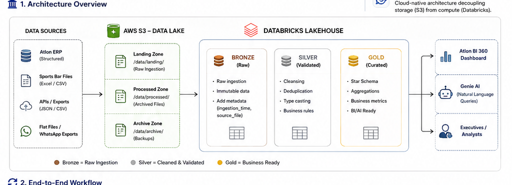
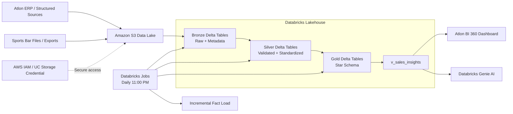
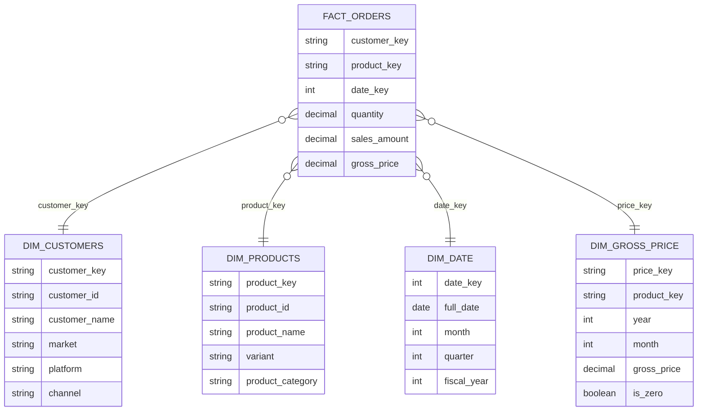
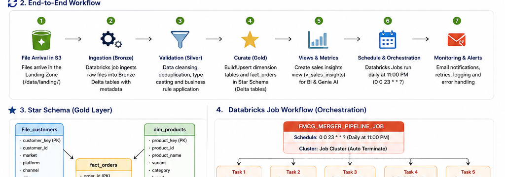
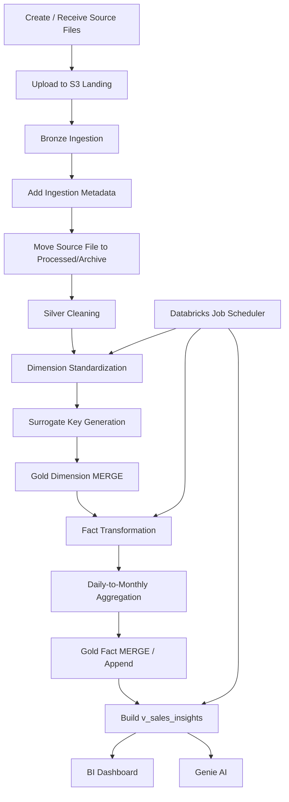
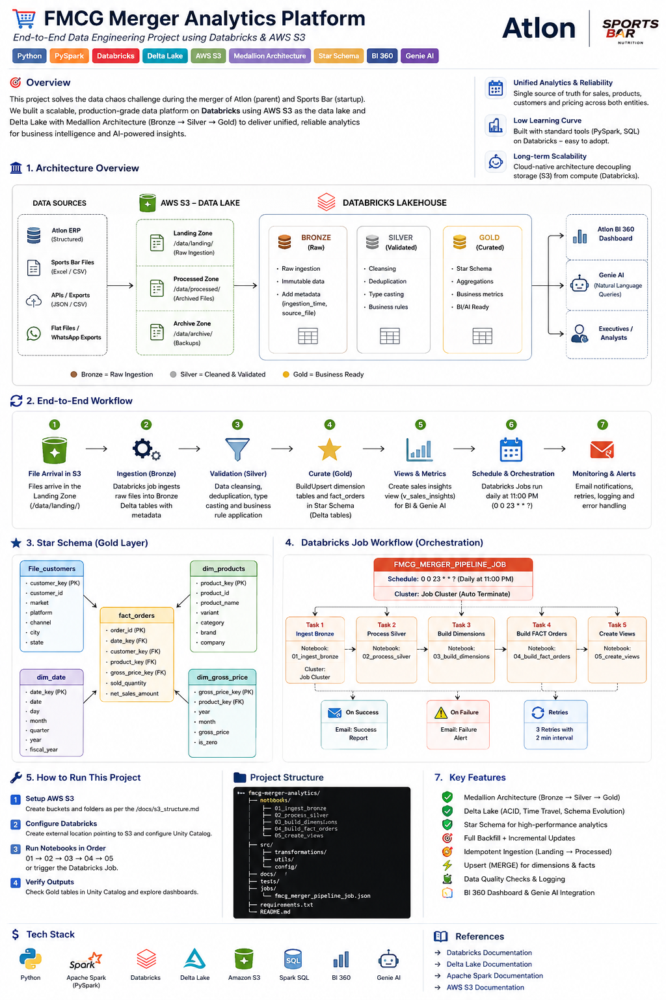
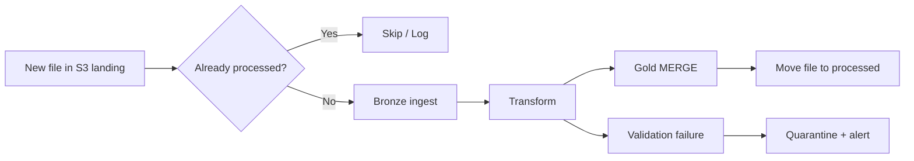

# End-to-End Data Engineering for FMCG Merger Analytics

### Databricks + AWS S3 + PySpark + Spark SQL + Delta Lake

> **Project:** Atlon × Sports Bar — Unified FMCG Sales & Supply Chain Analytics Platform


---


## 📌 Project Overview

The acquisition of **Sports Bar**, a fast-growing energy nutrition startup, created a classic FMCG data-integration problem: two organizations with different schemas, identifiers, pricing granularity, file formats, and operational processes needed to produce **one trusted analytical view of the business**.

Atlon already had mature ERP-oriented data, while Sports Bar's information was fragmented across spreadsheets, cloud storage, exports, and inconsistent interfaces. The objective of this project is to convert that fragmented information into a governed and repeatable **Lakehouse data platform**.

The solution uses an **AWS S3 data lake + Databricks + Delta Lake + Medallion Architecture + Star Schema** to produce a unified Gold layer for BI and AI-driven analysis.

### Business Outcomes

- One standardized view of sales across Atlon and Sports Bar.
- Consistent customer and product dimensions after schema reconciliation.
- Auditable pricing transformations and corrections.
- Monthly sales aggregation aligned with Atlon's reporting grain.
- Idempotent file processing to prevent duplicate financial metrics.
- Production-style orchestration with dependencies, retries, and notifications.
- BI-ready `v_sales_insights` view for dashboards and natural-language analytics.

---

## 🧠 Core Problem

### Before Integration

```text
Atlon ERP                  Sports Bar
   │                           │
   ├── Structured data         ├── Spreadsheets
   ├── Numeric product IDs     ├── Cloud-drive exports
   ├── Annual pricing          ├── Alphanumeric IDs
   └── Monthly reporting       ├── Monthly pricing
                               └── Daily transactions
                  │
                  ▼
          ❌ Conflicting Metrics
          ❌ Duplicate Records
          ❌ Missing Attributes
          ❌ Incompatible Schemas
          ❌ Difficult Forecasting
```

### After Integration

```text
                  AWS S3 Landing Zone
                         │
                         ▼
                  ┌───────────────┐
                  │ Bronze / Raw  │
                  │ Immutable     │
                  └───────┬───────┘
                          │
                          ▼
                  ┌───────────────┐
                  │ Silver /      │
                  │ Validated     │
                  └───────┬───────┘
                          │
                          ▼
                  ┌───────────────┐
                  │ Gold / Curated│
                  │ Star Schema   │
                  └───────┬───────┘
                          │
             ┌────────────┼────────────┐
             ▼            ▼            ▼
          Power BI      Databricks   Genie AI
          Dashboard     SQL/BI       NL Queries
```

---

# 🏗️ Architecture

## High-Level Architecture

> ### Architecture Visual
>
> 
>
> *Visual: AWS S3 landing/processed zones → Databricks Medallion Architecture → Gold analytics and BI/AI consumption.*



## Medallion Architecture

| Layer | Purpose | Typical Operations | Output |
|---|---|---|---|
| **Bronze** | Preserve source truth | Ingestion, metadata capture, schema preservation | Raw Delta tables |
| **Silver** | Make data trustworthy | Type casting, trimming, deduplication, standardization, business rules | Validated Delta tables |
| **Gold** | Serve analytics | Modeling, surrogate keys, aggregation, merges, dimensional integration | Star schema + views |

### Bronze Layer

The Bronze layer is designed to be **append-oriented and auditable**.

Typical metadata columns:

- `ingestion_timestamp`
- `source_filename`
- `source_system`
- `ingestion_date`

The raw payload is retained so historical records can be reprocessed when transformation logic changes.

### Silver Layer

The Silver layer applies the data-quality rules required to make Atlon and Sports Bar compatible:

- String trimming and normalization.
- `INITCAP`/case standardization where appropriate.
- Data-type casting.
- Duplicate removal.
- Null handling.
- Regex-based product parsing.
- Product-name correction.
- Customer attribute corrections.
- Negative/invalid pricing validation.
- Standardized dates and reporting grain.

### Gold Layer

The Gold layer is optimized for business analytics and uses a **Star Schema**.



---

# 📊 Gold Data Model

## Fact Table: `fact_orders`

The central transaction table contains the analytical grain used by the merged business.

Suggested logical fields:

| Column | Description |
|---|---|
| `customer_key` | Unified customer surrogate key |
| `product_key` | Unified product surrogate key |
| `date_key` | Link to `dim_date` |
| `quantity` | Sold quantity |
| `sales_amount` | Revenue/value used for analytics |
| `gross_price` | Applied gross price |
| `source_system` | Atlon or Sports Bar |

## Dimensions

### `dim_customers`

Consolidates customer identifiers and business attributes from both companies.

Important rule:

> Customer **403** is manually mapped to **New Delhi** because the source did not contain a trustworthy city value that could be resolved automatically.

### `dim_products`

The product pipeline performs:

1. Regex-based separation of product and variant.
2. Spelling normalization such as `protein` corrections.
3. Harmonization of product hierarchy.
4. Surrogate-key generation.

Because Atlon uses numeric IDs while Sports Bar uses alphanumeric IDs, the unified Gold layer uses a deterministic **SHA-based surrogate key**.

Example concept:

```python
from pyspark.sql.functions import sha2, concat_ws

products = products.withColumn(
    "product_key",
    sha2(concat_ws("||", "source_system", "product_id"), 256)
)
```

### `dim_gross_price`

Pricing is normalized despite different source grains:

- Atlon: approximately one price per year.
- Sports Bar: prices supplied monthly.

A window function ranks monthly prices and selects the latest valid month as the yearly representative value where the merged reporting model requires annual pricing.

Example pattern:

```sql
WITH ranked_prices AS (
    SELECT
        product_key,
        year,
        month,
        gross_price,
        ROW_NUMBER() OVER (
            PARTITION BY product_key, year
            ORDER BY month DESC
        ) AS rn
    FROM silver_prices
)
SELECT *
FROM ranked_prices
WHERE rn = 1;
```

The `is_zero` flag is retained as an **auditability signal** instead of silently hiding suspicious zero values.

---

# 🔄 End-to-End Workflow

> ### Workflow Visual
>
> 
>
> *Visual: ingestion → Bronze → Silver → Gold → validation/publishing → scheduled orchestration and archival.*



## Processing Strategy

### 1. Initial Backfill

The first load processes the historical **July–November** transaction period.

```text
S3 Landing
   ↓
Bronze
   ↓
Silver
   ↓
Gold Dimensions
   ↓
Gold Fact Backfill
```

### 2. Incremental Load

New **December and subsequent daily files** are processed separately.

```text
New S3 File
   ↓
Detect / Validate
   ↓
Bronze Append
   ↓
Silver Transform
   ↓
Monthly Aggregation
   ↓
Gold Merge
```

### 3. Idempotency

A source file is moved from **Landing → Processed/Archive** after successful ingestion. This prevents accidental reprocessing of the same input file.

For row-level safety, Gold writes should additionally use deterministic keys and `MERGE` conditions.

---

# ☁️ AWS S3 Layout

A recommended bucket structure is:

```text
s3://<bucket-name>/
├── landing/
│   ├── customers/
│   ├── products/
│   ├── prices/
│   └── orders/
│
├── processed/
│   ├── customers/
│   ├── products/
│   ├── prices/
│   └── orders/
│
├── quarantine/
│
└── archive/
```

### Folder Responsibilities

| Path | Purpose |
|---|---|
| `landing/` | New source files waiting for ingestion |
| `processed/` | Successfully ingested files |
| `quarantine/` | Files that fail validation |
| `archive/` | Long-term retention / historical source copies |

> **Security note:** Never hard-code AWS access keys in notebooks or source control. For Unity Catalog-based access, use a storage credential backed by an AWS IAM role and an S3 external location. Databricks currently recommends Unity Catalog as the governance layer for cloud object storage. See the official Databricks documentation linked at the bottom of this README.

---
## 🖼️ Architecture & Workflow Overview



---

# 🚀 How to Run the Project on Databricks

## Prerequisites

You need:

- An AWS account with an S3 bucket.
- A Databricks workspace with the required Unity Catalog/storage-access capabilities.
- Permission to create or use a **storage credential** and **external location**.
- Access to Databricks Jobs / Workflows.
- The project source files/notebooks.
- Input datasets for Atlon and Sports Bar.

### Important note about Databricks Free Edition

This project can be used as a learning/demo implementation on **Databricks Free Edition**, but Free Edition has service, compute, and feature limitations compared with a full Databricks deployment. This README therefore separates the **logical architecture** from workspace-specific feature availability. For a production-style deployment, use a Databricks workspace with the required Unity Catalog and AWS integrations.

---

## Step 1 — Create the S3 Bucket

In AWS:

1. Open **Amazon S3**.
2. Create a bucket with a globally unique name.
3. Create the folder structure shown above.
4. Upload the initial source files into `landing/`.
5. Restrict access using an IAM policy appropriate for the project.

Example target:

```text
s3://atlon-fmcg-merger-data/landing/
```

---

## Step 2 — Configure Databricks Access to S3

For current Databricks-on-AWS deployments, the recommended pattern is:

```text
AWS IAM Role
     ↓
Storage Credential
     ↓
Unity Catalog External Location
     ↓
S3 Path
```

Databricks requires the S3 bucket to exist before creating the external location. The storage credential represents the AWS IAM role, and the external location scopes access to the S3 path.

### Recommended UI flow

```text
Databricks Workspace
   → Catalog
   → Connect
   → Credentials
   → Create Storage Credential
```

Then:

```text
Catalog
   → Connect
   → External Locations
   → Create External Location
```

Configure the URL similar to:

```text
s3://atlon-fmcg-merger-data/
```

and select the storage credential.

### Example SQL pattern

Use placeholders appropriate to your workspace:

```sql
CREATE EXTERNAL LOCATION IF NOT EXISTS `atlon_fmcg_s3`
URL 's3://atlon-fmcg-merger-data/'
WITH (STORAGE CREDENTIAL `atlon_fmcg_storage_credential`);
```

Do not copy production credentials into GitHub.

---

## Step 3 — Create the Databricks Catalog and Schema

A clean logical structure is:

```text
Catalog: atlon_fmcg

Schemas:
├── bronze
├── silver
└── gold
```

Example:

```sql
CREATE CATALOG IF NOT EXISTS atlon_fmcg;

CREATE SCHEMA IF NOT EXISTS atlon_fmcg.bronze;
CREATE SCHEMA IF NOT EXISTS atlon_fmcg.silver;
CREATE SCHEMA IF NOT EXISTS atlon_fmcg.gold;
```

> Exact catalog/schema creation privileges depend on your Databricks account governance model.

---

## Step 4 — Create the Project Repository

Recommended GitHub structure:

```text
atlon-fmcg-merger-analytics/
│
├── README.md
│
├── notebooks/
│   ├── 01_bronze_ingestion.py
│   ├── 02_silver_customers.py
│   ├── 03_silver_products.py
│   ├── 04_silver_prices.py
│   ├── 05_gold_dimensions.py
│   ├── 06_gold_fact_orders.py
│   ├── 07_incremental_orders.py
│   └── 08_sales_insights.py
│
├── sql/
│   ├── create_catalog.sql
│   ├── create_schemas.sql
│   ├── create_dimensions.sql
│   ├── create_fact.sql
│   └── create_views.sql
│
├── config/
│   └── project_config.json
│
├── tests/
│   ├── test_customer_rules.py
│   ├── test_product_keys.py
│   └── test_sales_reconciliation.py
│
└── docs/
    ├── architecture.md
    └── data_dictionary.md
```

### Suggested Databricks notebook flow

| Task | Notebook | Dependency |
|---|---|---|
| Bronze ingestion | `01_bronze_ingestion` | S3 |
| Customer cleansing | `02_silver_customers` | Bronze |
| Product cleansing | `03_silver_products` | Bronze |
| Price cleansing | `04_silver_prices` | Bronze |
| Gold dimensions | `05_gold_dimensions` | Silver |
| Gold fact | `06_gold_fact_orders` | Gold dimensions + Silver facts |
| Incremental fact | `07_incremental_orders` | Gold dimensions |
| BI/AI view | `08_sales_insights` | Gold |

---

# 🧪 Step 5 — Configure Notebook Parameters

Do not hard-code environment-specific paths.

Example configuration:

```python
CATALOG = "atlon_fmcg"
BRONZE_SCHEMA = "bronze"
SILVER_SCHEMA = "silver"
GOLD_SCHEMA = "gold"

S3_ROOT = "s3://atlon-fmcg-merger-data"
LANDING_PATH = f"{S3_ROOT}/landing"
PROCESSED_PATH = f"{S3_ROOT}/processed"
QUARANTINE_PATH = f"{S3_ROOT}/quarantine"
```

For a more production-ready implementation, pass these values as **Databricks Job parameters** instead of embedding environment configuration inside notebooks.

---

# 🥉 Step 6 — Run Bronze Ingestion

Typical Bronze pattern:

```python
from pyspark.sql.functions import current_timestamp, input_file_name

source_path = f"{LANDING_PATH}/orders/"

bronze_df = (
    spark.read
         .option("header", True)
         .csv(source_path)
         .withColumn("ingestion_timestamp", current_timestamp())
         .withColumn("source_filename", input_file_name())
)

(bronze_df.write
    .format("delta")
    .mode("append")
    .saveAsTable(f"{CATALOG}.{BRONZE_SCHEMA}.orders"))
```

Repeat the same pattern for customers, products, and prices using the appropriate source schema.

---

# 🥈 Step 7 — Run Silver Transformations

## Customer Cleaning

Illustrative transformation:

```python
from pyspark.sql.functions import col, trim, initcap, when

customers = (
    spark.table(f"{CATALOG}.{BRONZE_SCHEMA}.customers")
    .withColumn("customer_name", initcap(trim(col("customer_name"))))
    .withColumn("city", initcap(trim(col("city"))))
)

customers = customers.withColumn(
    "city",
    when(col("customer_id") == 403, "New Delhi")
    .otherwise(col("city"))
)
```

## Product Cleaning

Apply:

- Regex extraction for product/variant.
- Spelling standardization.
- Null/blank handling.
- Source-system tagging.
- Deterministic surrogate key generation.

## Price Cleaning

Apply:

- Cast price to numeric.
- Convert negative values to a controlled exception state.
- Handle `Unknown` values.
- Generate `is_zero` audit flag.
- Apply month ranking where annual representative pricing is required.

---

# 🥇 Step 8 — Build the Gold Dimensions

Dimensions should be established **before the fact table**.

### MERGE Pattern

```sql
MERGE INTO atlon_fmcg.gold.dim_customers AS target
USING atlon_fmcg.silver.customers AS source
ON target.customer_key = source.customer_key

WHEN MATCHED THEN UPDATE SET *
WHEN NOT MATCHED THEN INSERT *;
```

Use the same strategy for `dim_products` and other dimensions where the business key allows deterministic upserts.

---

# 💰 Step 9 — Process the Fact Table

Sports Bar transactions arrive at a **daily grain**, while the merged analytical model requires **monthly reporting**.

### Example aggregation pattern

```sql
SELECT
    date_trunc('month', order_date) AS order_month,
    customer_key,
    product_key,
    SUM(quantity) AS quantity,
    SUM(sales_amount) AS sales_amount
FROM atlon_fmcg.silver.orders
GROUP BY
    date_trunc('month', order_date),
    customer_key,
    product_key;
```

The final Gold fact should be written using a deterministic business grain, for example:

```text
month + customer_key + product_key + source_system
```

This helps make re-runs safe and avoids duplicate monthly aggregates.

---

# 🔁 Step 10 — Incremental Load and Idempotency

A robust production flow should behave like this:



### Recommended safeguards

- Track processed filenames or ingestion IDs.
- Keep the raw file metadata.
- Use deterministic surrogate keys.
- Use `MERGE` for update/insert semantics.
- Never mark a source file as processed before the downstream write succeeds.
- Send failures to quarantine instead of silently dropping them.

---

# ⏰ Step 11 — Create the Databricks Job

Create a **multi-task Databricks Job** with dependencies.

Recommended DAG:

```text
                    ┌──────────────────────┐
                    │ 01 Bronze Ingestion   │
                    └──────────┬───────────┘
                               │
                  ┌────────────┼────────────┐
                  ▼            ▼            ▼
          02 Customers   03 Products   04 Prices
                  └────────────┼────────────┘
                               ▼
                    ┌──────────────────────┐
                    │ 05 Gold Dimensions   │
                    └──────────┬───────────┘
                               ▼
                    ┌──────────────────────┐
                    │ 06 Gold Fact Orders  │
                    └──────────┬───────────┘
                               ▼
                    ┌──────────────────────┐
                    │ 07 Incremental Load  │
                    └──────────┬───────────┘
                               ▼
                    ┌──────────────────────┐
                    │ 08 Sales Insights    │
                    └──────────────────────┘
```

### Suggested job configuration

| Setting | Recommended value |
|---|---|
| Job type | Multi-task Workflow |
| Trigger | Scheduled |
| Time | 11:00 PM |
| Time zone | Asia/Kolkata, if running on IST |
| Retry policy | 2–3 retries for transient failures |
| Notifications | On failure + optionally on success |
| Max concurrent runs | 1 for a strictly sequential pipeline |

Databricks supports advanced scheduled triggers where you can specify the schedule and time zone.

### Cron Expression

The project's original schedule is:

```text
0 0 23 * * ?
```

This corresponds to **11:00 PM daily** when the job time zone is configured accordingly.

> Always verify the job's configured time zone rather than assuming the workspace time zone.

---

# 📈 Step 12 — Build the Executive View

Create a denormalized analytical view named:

```text
atlon_fmcg.gold.v_sales_insights
```

Conceptually:

```sql
CREATE OR REPLACE VIEW atlon_fmcg.gold.v_sales_insights AS
SELECT
    f.order_month,
    c.market,
    c.platform,
    c.channel,
    p.product_name,
    p.variant,
    SUM(f.quantity) AS sold_quantity,
    SUM(f.sales_amount) AS revenue
FROM atlon_fmcg.gold.fact_orders f
JOIN atlon_fmcg.gold.dim_customers c
  ON f.customer_key = c.customer_key
JOIN atlon_fmcg.gold.dim_products p
  ON f.product_key = p.product_key
GROUP BY
    f.order_month,
    c.market,
    c.platform,
    c.channel,
    p.product_name,
    p.variant;
```

Use the final business definitions from your project specification when calculating revenue and pricing measures.

---

# 🤖 Genie AI / Natural Language Analytics

The Gold view is intended to act as a clean semantic foundation for Databricks Genie or other natural-language analytics experiences.

Example business questions:

```text
1. Show the top 5 products by revenue for the current quarter.
2. What is the revenue share by channel?
3. What are the top 5 customers by sold quantity?
4. Compare Atlon and Sports Bar revenue this year.
5. Which product variants have the highest volume?
```

The important design principle is:

```text
Messy operational data
        ↓
Validated Gold model
        ↓
Business-friendly view
        ↓
BI / Genie / AI
```

AI quality depends heavily on the quality and semantics of the Gold layer.

---

# 📊 BI Dashboard Recommendations

Build an **Atlon BI 360** dashboard around `v_sales_insights`.

Recommended sections:

### Executive KPI Cards

- Total Revenue (INR)
- Total Quantity
- Number of Active Customers
- Number of Products
- Sports Bar Revenue Contribution

### Revenue Analytics

- Monthly revenue trend.
- Revenue by channel.
- Revenue by market.
- Atlon vs Sports Bar comparison.

### Product Analytics

- Top 10 products by revenue.
- Top products by quantity.
- Variant performance.

### Customer Analytics

- Top customers by revenue.
- Top customers by quantity.
- Channel contribution.

---

# ✅ Data Quality Checks

A production-oriented implementation should validate the pipeline before publishing Gold data.

## Customer Checks

```text
✓ Customer key uniqueness
✓ Missing customer IDs
✓ Invalid city mappings
✓ Duplicate customer records
```

## Product Checks

```text
✓ Product key uniqueness
✓ Null product IDs
✓ Variant extraction quality
✓ Standardized product names
```

## Price Checks

```text
✓ Negative price detection
✓ Unknown price detection
✓ Zero-price audit flag
✓ Latest-month selection logic
```

## Fact Checks

```text
✓ Duplicate business grain detection
✓ Quantity >= 0 where required
✓ Sales reconciliation against source
✓ Month-level totals
✓ Atlon + Sports Bar reconciliation
```

### Example duplicate check

```sql
SELECT
    order_month,
    customer_key,
    product_key,
    source_system,
    COUNT(*) AS row_count
FROM atlon_fmcg.gold.fact_orders
GROUP BY
    order_month,
    customer_key,
    product_key,
    source_system
HAVING COUNT(*) > 1;
```

Expected result:

```text
0 duplicate groups
```

---

# 🔐 Security & Governance

Follow these practices for a production implementation:

- Use **Unity Catalog** for governed access to cloud storage and data objects.
- Use AWS IAM roles rather than embedded credentials.
- Grant least-privilege access to S3 paths.
- Separate development, test, and production catalogs/workspaces where appropriate.
- Keep secrets out of notebooks and Git.
- Restrict Bronze access to users who actually need raw-source visibility.
- Use Gold views for business-facing consumption.
- Record ingestion metadata for traceability.

---

# 🕘 Operational Monitoring

Monitor each task for:

```text
Pipeline status
    ↓
Task duration
    ↓
Input rows
    ↓
Output rows
    ↓
Rejected rows
    ↓
Duplicate counts
    ↓
Gold reconciliation
```

### Failure-handling pattern

```text
Task Failure
    ├── Retry transient error
    ├── Log exception
    ├── Keep source file unprocessed
    └── Send notification
```

Avoid moving a file to `processed/` if the corresponding Bronze/Gold workflow has not completed successfully.

---

# 🧩 Example MERGE for Incremental Facts

A simplified Delta Lake upsert can look like:

```sql
MERGE INTO atlon_fmcg.gold.fact_orders AS target
USING atlon_fmcg.silver.monthly_orders AS source
ON  target.order_month  = source.order_month
AND target.customer_key = source.customer_key
AND target.product_key  = source.product_key
AND target.source_system = source.source_system

WHEN MATCHED THEN UPDATE SET
    target.quantity = source.quantity,
    target.sales_amount = source.sales_amount,
    target.gross_price = source.gross_price

WHEN NOT MATCHED THEN INSERT (
    order_month,
    customer_key,
    product_key,
    source_system,
    quantity,
    sales_amount,
    gross_price
)
VALUES (
    source.order_month,
    source.customer_key,
    source.product_key,
    source.source_system,
    source.quantity,
    source.sales_amount,
    source.gross_price
);
```

The exact match condition must reflect the project's true business grain.

---

# 🔎 Delta Lake Auditability

Delta tables provide transaction history that can be used for investigation and auditing.

Useful operations include:

```sql
DESCRIBE HISTORY atlon_fmcg.gold.fact_orders;
```

When supported by the deployed Delta/Databricks environment, historical versions can also be queried for investigation or rollback workflows.

Example pattern:

```sql
SELECT *
FROM atlon_fmcg.gold.fact_orders VERSION AS OF 10;
```

Do not treat Time Travel as a substitute for a formal backup/retention strategy.

---

# 🧪 How to Validate the Full Pipeline

Run the project in this order for the first deployment:

```text
1. Create S3 bucket + folders
2. Configure IAM permissions
3. Configure Databricks S3 external location
4. Create catalog + schemas
5. Run Bronze ingestion
6. Validate Bronze row counts
7. Run Silver transformations
8. Validate dimensions
9. Run Gold dimensions
10. Run initial fact backfill
11. Reconcile revenue + quantity
12. Run incremental load with a test file
13. Confirm idempotency by re-running the same test
14. Build v_sales_insights
15. Connect BI / Genie
16. Create scheduled Job
17. Test failure/retry behavior
```

---

# 🧾 Expected Reconciliation Checks

The most important business validation is not simply whether the Spark job succeeds. It is whether the **merged numbers make business sense**.

Recommended checks:

| Check | Expected result |
|---|---|
| Source rows vs Bronze rows | Reconciled / explainable differences |
| Bronze vs Silver records | Differences explained by cleansing rules |
| Silver vs Gold dimensions | Keys and counts reconciled |
| Sports Bar monthly sales | Matches source aggregation |
| Atlon monthly sales | Matches source/ERP baseline |
| Combined revenue | Atlon + Sports Bar reconciled |
| Duplicate Gold grain | `0` |
| Invalid product keys | `0` |
| Unexpected negative revenue | `0` unless business-approved |

---

# 🛠️ Troubleshooting

## `PERMISSION_DENIED` / S3 access failure

Check:

1. The S3 bucket exists.
2. The Databricks storage credential references the correct IAM role.
3. The IAM role can access the required bucket/path.
4. The Unity Catalog external location points to the expected S3 URI.
5. The user/service principal has access to the external location.

## Duplicate records after rerun

Check:

- Source-file movement logic.
- Processed-file tracking.
- Gold `MERGE` condition.
- Business-grain uniqueness.
- Whether the same file was manually copied back into `landing/`.

## Incorrect monthly totals

Check:

- Date parsing.
- Time-zone handling if timestamps are used.
- `date_trunc('month', ...)` logic.
- Duplicate source transactions.
- Join cardinality between facts and dimensions.

## Missing customer/product matches

Check:

- Source-system identifiers.
- Surrogate-key generation.
- Null/blank normalization.
- Whether dimensions were successfully loaded before facts.

---

# 📚 Technology Stack

| Technology | Role |
|---|---|
| **Python** | Pipeline control and transformation logic |
| **PySpark** | Distributed data processing |
| **Spark SQL** | Data modeling, aggregation, merging |
| **Databricks** | Lakehouse compute, notebooks, Jobs, BI/AI tooling |
| **Delta Lake** | ACID tables, history, reliable writes |
| **AWS S3** | Durable object storage / data lake |
| **Unity Catalog** | Governance and cloud-storage access control |
| **Databricks Jobs** | Scheduling and orchestration |
| **Power BI / BI tooling** | Executive analytics |
| **Databricks Genie** | Natural-language analytics |

---

# 🎯 Why This Architecture?

### Medallion Architecture

Separates raw ingestion, quality transformation, and business-ready assets so each stage has a clear purpose.

### Delta Lake

Provides reliable transactional writes and table history for a lakehouse-style analytical platform.

### Star Schema

Keeps the Gold layer understandable and efficient for BI workloads.

### S3 + Databricks Separation

Storage is decoupled from compute, allowing the analytical platform to scale without binding the data to a single compute environment.

### Idempotent Processing

Critical for financial and executive reporting because re-running a job must not silently double-count sales.

---

# 📌 Production Enhancements

For a full enterprise deployment, the next improvements would include:

- Unity Catalog lineage and fine-grained permissions.
- Automated data-quality testing with expectations/validation frameworks.
- Schema evolution controls.
- CI/CD for Databricks notebooks and SQL.
- Infrastructure as Code using Terraform.
- Centralized logging and alerting.
- Data contracts with source systems.
- Automated reconciliation reports.
- Partitioning/clustering strategy based on actual query patterns.
- Separate dev/test/prod environments.
- Automated recovery and backfill workflows.

---

# 📖 Official References

The implementation choices in this README align with current Databricks-on-AWS guidance as of **August 2026**:

- [Databricks — Connect to cloud object storage](https://docs.databricks.com/aws/en/connect)
- [Databricks — Create an S3 storage credential and external location](https://docs.databricks.com/aws/en/connect/unity-catalog/cloud-storage/s3/s3-external-location-manual)
- [Databricks — Create an S3 external location with automated setup](https://docs.databricks.com/aws/en/connect/unity-catalog/cloud-storage/s3/automatedsetups3)
- [Databricks — Manage storage credentials](https://docs.databricks.com/aws/en/connect/unity-catalog/cloud-storage/manage-storage-credentials)
- [Databricks — Schedule Jobs](https://docs.databricks.com/aws/en/jobs/scheduled)
- [Databricks — Free Edition limitations](https://docs.databricks.com/aws/en/getting-started/free-edition-limitations)

---

# 👨‍💻 Author

**Atlon × Sports Bar Merger Analytics — Data Engineering Project**

Built as an end-to-end demonstration of modern cloud data engineering, lakehouse architecture, data quality, incremental processing, orchestration, and executive analytics.

---

## ⭐ If this project is useful

Give the repository a ⭐ and use the architecture as a starting point for other multi-source merger, FMCG, retail, supply-chain, or sales analytics workloads.
